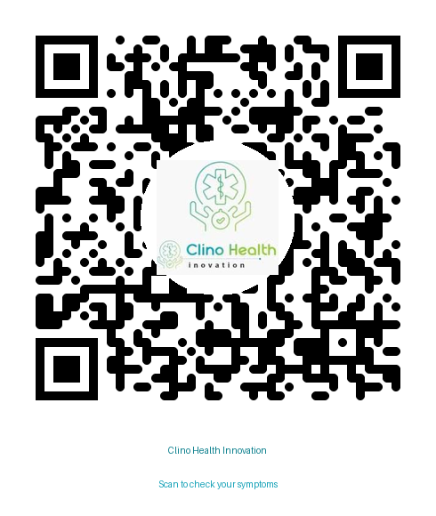

# 🏥 Clino Health Innovation
### AI-Powered Symptom Checker & Disease Predictor

> A production-grade healthcare assistant that analyzes user-described symptoms using Google Gemini AI and returns a structured medical report — including a predicted condition, home remedies, and precautions. Built for live event demonstration and real-world deployment.

---

## 🔗 Try It Live — Scan or Click

<p align="center">
  
  <br/>
  <b>📱 Scan to instantly launch the app on your phone</b>
  <br/><br/>
  <a href="https://clino-health-diseasepredictionbot.streamlit.app/">
    🌐 clino-health-diseasepredictionbot.streamlit.app
  </a>
</p>

---

## ✨ Features

- 🤖 **AI-Powered Diagnosis** — Gemini AI analyzes symptoms like an experienced physician
- 💬 **Understands Everyday Language** — Type "tummy hurts" or "pee burns" — Dr. Clino gets it
- 🚨 **Emergency Detection** — Instantly flags life-threatening symptoms with a red alert banner
- 📊 **Severity Grading** — Mild / Moderate / Severe with dynamic color-coded indicators
- 🌿 **Home Remedies** — 5 safe, practical, condition-specific remedies explained simply
- ⚠️ **Smart Precautions** — Clear ✅ DO's and ❌ DON'Ts specific to your condition
- 🏥 **When to See a Doctor** — Exact warning signs in plain everyday language
- 💡 **Fun Health Fact** — One interesting fact per diagnosis
- ⚕️ **AI-Powered Disclaimer** — Dynamic, human-friendly medical disclaimer
- 🔒 **Secure Secret Management** — API key via Streamlit secrets, never hardcoded
- ⚡ **Reliable JSON Output** — XML-structured prompt enforces consistent AI responses

---

## 🛠️ Tech Stack

| Layer | Tool |
|---|---|
| **Frontend & Server** | Streamlit |
| **AI Model** | Google `gemini-2.5-flash` |
| **AI SDK** | `google-genai` (new modern SDK) |
| **Language** | Python 3.10+ |
| **Styling** | Custom CSS (`style.css`) |
| **Secret Management** | Streamlit `st.secrets` → `os.environ` |
| **Deployment** | Streamlit Community Cloud |

---

## 📁 Folder Structure

```
Disease_Prediction_Bot/
│
├── app.py                         # Streamlit UI — input, HTML card injection, error handling
├── api.py                         # Gemini API — configure client, call model, parse response
├── prompt.py                      # XML-structured prompt — layman detection, dual-format medical responses
├── style.css                      # All custom CSS — separated from Python logic
│
├── requirements.txt               # Project dependencies
├── .gitignore                     # Ignores .venv, real secrets.toml, __pycache__
│
└── .streamlit/
    ├── config.toml                # Streamlit theme settings (Blue / White / Green)
    ├── secrets.toml               # ⚠️  Your real API key — NEVER commit this
    └── secrets.toml.example       # ✅  Safe placeholder — committed to GitHub
└── assets/
    └── clino_qr.png               # QR code for live app access (For the event)
```

---

## 🔗 Architecture

Each file has a **single responsibility**. Here is how they connect:

```
app.py  ──imports──▶  api.py  ──imports──▶  prompt.py
  │                      │                      │
  │                      │                      │
  UI & error display    Gemini API call     XML-tagged prompt engine
  st.error()            raise ValueError()  layman detection + dual-format
  st.spinner()          json.loads()        build_prompt()
  HTML card injection   os.environ bridge
```

**Key design rules followed:**
- `app.py` is the only file that uses Streamlit — all `st.*` calls live here
- `api.py` raises plain Python exceptions — never touches Streamlit
- `style.css` holds all CSS — `app.py` injects HTML cards dynamically with AI results

---

## ⚙️ Local Setup

### 1️⃣ Clone the Repository

```bash
git clone https://github.com/YOUR_USERNAME/clino_health.git
cd clino_health
```

### 2️⃣ Create & Activate Virtual Environment

```bash
# Create virtual environment
python -m venv .venv
```

```bash
# Activate — Mac / Linux
source .venv/bin/activate

# Activate — Windows
.venv\Scripts\activate
```

### 3️⃣ Install Dependencies

```bash
pip install -r requirements.txt
```

### 4️⃣ Set Up Your API Key

Copy the example secrets file:

```bash
# Mac / Linux
cp .streamlit/secrets.toml.example .streamlit/secrets.toml

# Windows
copy .streamlit\secrets.toml.example .streamlit\secrets.toml
```

Open `.streamlit/secrets.toml` and paste your real key:

```toml
GEMINI_API_KEY = "your_real_gemini_api_key_here"
```

> 🔑 Get your free Gemini API key at [aistudio.google.com](https://aistudio.google.com) → **Get API Key**

### 5️⃣ Run the App

```bash
streamlit run app.py
```

The app will open at `http://localhost:8501` 🎉

---

## ☁️ Streamlit Cloud Deployment

1. **Push your repo to GitHub** — confirm `.streamlit/secrets.toml` is listed in `.gitignore` before pushing
2. Go to **[share.streamlit.io](https://share.streamlit.io)** → Sign in → click **New App**
3. Connect your GitHub repository and set **Main file path** to `app.py`
4. Open **Settings → Secrets** and add:
    ```toml
    GEMINI_API_KEY = "your_real_gemini_api_key_here"
    ```
5. Click **Deploy** — Streamlit gives you a live public URL in minutes 🌐
6. An `assets/` folder with `clino_qr.png` is already in the repo — scan it directly above from this README file 

---

## 🔐 Security Design

| What | How |
|---|---|
| API key storage locally | `.streamlit/secrets.toml` (git-ignored) |
| API key storage on cloud | Streamlit Cloud Secrets dashboard |
| How code accesses it | `st.secrets` → mapped to `os.environ` |
| What is safe to commit | `secrets.toml.example` (no real values) |
| What is never committed | `secrets.toml`, `.venv/`, `__pycache__/` |

---

## 📦 Dependencies

```
streamlit
google-genai
```

Install with:
```bash
pip install -r requirements.txt
```

---

## 👨‍💻 Developer

**Abinash Panigrahi**
Developed for **Clino Health Innovation**
Demonstrated live at a technology & investment event

---

## ⚕️ Medical Disclaimer

> This application is powered by artificial intelligence and is intended **strictly for informational and demonstration purposes only.**
> It is **not** a substitute for professional medical advice, diagnosis, or treatment.
> Always consult a qualified and licensed healthcare provider for any medical concerns.
> Never disregard or delay seeking professional medical advice based on information provided by this tool.
> **In a medical emergency, contact your local emergency services immediately.**

---

_© 2026 Clino Health Innovation. All rights reserved._